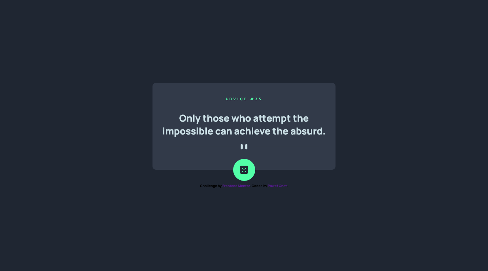

# Frontend Mentor - Advice generator app solution

This is a solution to the [Advice generator app challenge on Frontend Mentor](https://www.frontendmentor.io/challenges/advice-generator-app-QdUG-13db). Frontend Mentor challenges help you improve your coding skills by building realistic projects.

## Table of contents

- [Overview](#overview)
  - [Screenshot](#screenshot)
  - [Links](#links)
- [My process](#my-process)
  - [Built with](#built-with)
  - [What I learned](#what-i-learned)
- [Author](#author)

## Overview

### Screenshot

### Links

- Live Site URL: [Frontend Mentor Advice generator app](https://pawel-gnat.github.io/Frontend-Mentor-Advice-generator-app/)

## My process

Java Script:

1. Created button variable
2. Created async function to fetch url API
3. Added animate dice funtion while button has been clicked
4. Added onload function to insert random advice

### Built with

- Semantic HTML5 markup
- CSS custom properties
- Flexbox
- Mobile-first workflow
- JavaScript

### What I learned

I completed this app within 3,5 hours. I learned how to fetch url API, what "cache" is and how to use it in my code. 

Links that I found helpful to solve current challenge:

- https://hacks.mozilla.org/2016/03/referrer-and-cache-control-apis-for-fetch/
- https://developer.mozilla.org/en-US/docs/Web/API/Request/cache

Added short dice roll animation.

## Author

- Frontend Mentor - [@Pawel-Gnat](https://www.frontendmentor.io/profile/Pawel-Gnat)
